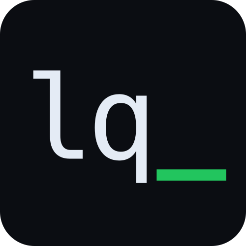

  

<h3 align="center">offchain orderbook · onchain settlement</h3>

---

## What

LiqCx is a decentralized perpetual futures exchange. Orders match offchain
for CEX-grade latency; every fill settles trustlessly onchain.

Users keep custody. Liquidity is pooled. The matching engine is a
convenience layer, not a gatekeeper.

## Why

Current perp DEXes force a tradeoff:

- **CEX-like UX** — fast, deep books, but centralized custody and matching.
- **True decentralization** — slow, expensive, thin liquidity.

LiqCx splits the problem. Matching runs offchain at sub-millisecond
latency. Settlement, margin, and funding remain fully onchain and verifiable.

## How it works

1. Orders are signed EIP-712 by the user and submitted to the gateway.
2. The offchain engine matches orders with strict price-time priority.
3. Batched fills are settled onchain in a single transaction.
4. Positions are tracked onchain against a shared liquidity pool, which
   is always the counterparty.

## Security

Report vulnerabilities to **security@liq.cx**.

Please do not open public issues for security matters.
